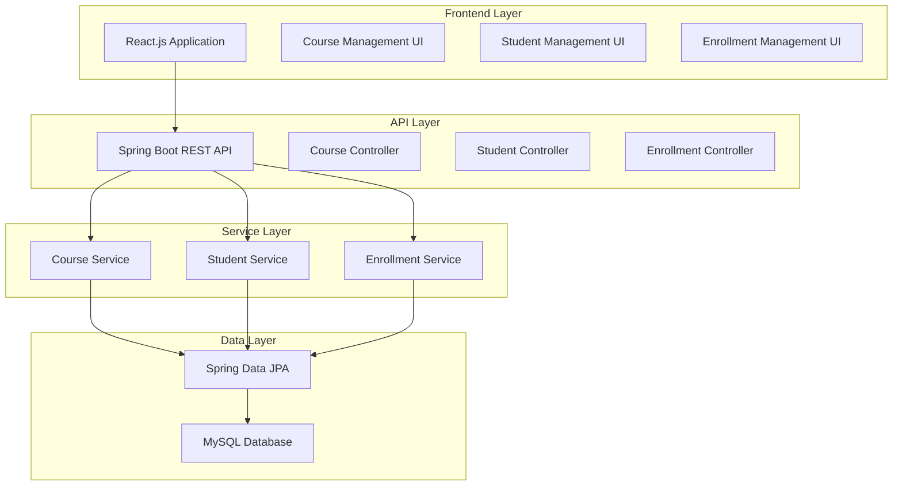

# University Course Management System

[](https://spring.io/projects/spring-boot)
[](https://reactjs.org/)
[](https://www.oracle.com/java/)
[](https://nodejs.org/)
[](https://www.mysql.com/)
[](LICENSE)

A modern, full-stack web application for managing university courses, student registrations, and enrollments. Built with Spring Boot (backend) and React.js (frontend) to demonstrate contemporary enterprise application development practices.

## 🎯 Project Overview

This project showcases the transition from legacy Java EE technologies (Servlets, JSP, EJBs) to modern, scalable solutions. The system provides a comprehensive platform for academic institutions to manage their course offerings, student data, and enrollment processes through an intuitive web interface.

### 🎓 Academic Context
- **Course:** Modern Enterprise Application Development
- **Target:** Undergraduate Students (3rd/4th Year - IT, SE, CS)
- **Objective:** Build enterprise-level applications using contemporary tech stack
- **Developer:** Sudesh Maduwantha
- **Email:** sudeshmaduwantha205@gmail.com

## 🚀 Live Demo

🔗 **Repository:** [https://github.com/SudeshMaduwantha/University-Course-Management-System](https://github.com/SudeshMaduwantha/University-Course-Management-System)

> 💡 **Note:** Live deployment links will be added here once the application is deployed to cloud platforms like Render, Heroku, or Railway.

## ✨ Key Features

### 🎓 Academic Management
- **Course Management** - Create, update, and manage course offerings
- **Student Registration** - Handle student profiles and academic information
- **Enrollment System** - Process course enrollments with capacity management
- **Results Tracking** - Manage and track student grades and performance

### 🛠 Technical Features
- **Modern REST API** - Clean, RESTful backend services
- **Responsive UI** - Mobile-first, responsive React frontend
- **Real-time Updates** - Dynamic data updates without page refresh
- **Input Validation** - Comprehensive client and server-side validation
- **Error Handling** - User-friendly error messages and recovery
- **Database Integration** - Robust MySQL database with proper relationships

## 🏗 Architecture Overview



## 🛠 Technology Stack Comparison

| **Component** | **Legacy Technology** | **Modern Solution** | **Benefits** |
|---------------|----------------------|-------------------|--------------|
| **Backend Framework** | Java Servlets | Spring Boot REST API | Better abstraction, built-in security |
| **Frontend** | JSP (Java Server Pages) | React.js | Component-based, better UX |
| **Business Logic** | EJB (Enterprise JavaBeans) | Spring Services + JPA | Simplified DI, better performance |
| **Configuration** | XML Configuration | YAML + Annotations | More readable, less boilerplate |
| **Web Services** | SOAP | RESTful APIs (JSON) | Lightweight, better performance |
| **Deployment** | Traditional App Server | Embedded Tomcat + Docker | Easier deployment, containerization |
| **Data Access** | Raw JDBC | Spring Data JPA/Hibernate | ORM benefits, reduced boilerplate |

## 📁 Project Structure

```
University-Course-Management-System/
├── 📁 backend/                          # Spring Boot API
│   ├── src/main/java/
│   │   └── com/university/coursemanagement/
│   │       ├── 🚀 CourseManagementApplication.java
│   │       ├── 📁 controller/           # REST Controllers
│   │       ├── 📁 service/              # Business Logic
│   │       ├── 📁 repository/           # Data Access
│   │       ├── 📁 entity/               # JPA Entities
│   │       └── 📁 config/               # Configuration
│   ├── src/main/resources/
│   │   ├── ⚙️ application.yml           # App Configuration
│   │   └── 📊 data.sql                  # Sample Data
│   ├── 🔧 pom.xml                       # Maven Dependencies
│   └── 📖 README.md                     # Backend Documentation
├── 📁 frontend/                         # React Application
│   ├── 📁 public/
│   ├── 📁 src/
│   │   ├── 📁 components/               # React Components
│   │   ├── 📁 pages/                    # Page Components
│   │   ├── 📁 services/                 # API Services
│   │   ├── 📁 styles/                   # CSS Styles
│   │   └── 🚀 App.js                    # Main App Component
│   ├── 📦 package.json                  # Node Dependencies
│   └── 📖 README.md                     # Frontend Documentation
├── 📁 docs/                            # Project Documentation
│   ├── 📊 database-schema.md            # Database Design
│   ├── 🎨 api-documentation.md          # API Endpoints
│   └── 🚀 deployment-guide.md           # Deployment Instructions
├── 🐳 docker-compose.yml               # Docker Configuration
├── 📖 README.md                        # This file
└── 📄 LICENSE                          # MIT License
```

## 🚀 Quick Start Guide

### Prerequisites

Ensure you have the following installed:

- **Java 17+** - For backend development
- **Node.js 18+** - For frontend development
- **MySQL 8.0+** - Database (or use Docker)
- **Maven 3.6+** - Build tool for backend
- **Git** - Version control

### 1. Clone Repository

```bash
git clone https://github.com/SudeshMaduwantha/University-Course-Management-System.git
cd University-Course-Management-System
```

### 2. Database Setup

#### Option A: Using Docker (Recommended)
```bash
# Start MySQL with Docker Compose
docker-compose up -d mysql
```

#### Option B: Local MySQL
```sql
CREATE DATABASE course_management;
CREATE USER 'courseuser'@'localhost' IDENTIFIED BY 'coursepass';
GRANT ALL PRIVILEGES ON course_management.* TO 'courseuser'@'localhost';
```

### 3. Backend Setup

```bash
# Navigate to backend directory
cd backend

# Build the application
mvn clean install

# Run the Spring Boot application
mvn spring-boot:run

# Backend will be available at http://localhost:8080
```

### 4. Frontend Setup

```bash
# Navigate to frontend directory (in a new terminal)
cd frontend

# Install dependencies
npm install

# Start the React development server
npm start

# Frontend will be available at http://localhost:3000
```

### 5. Verify Installation

- **Backend API:** http://localhost:8080/api/courses
- **Frontend App:** http://localhost:3000
- **API Documentation:** http://localhost:8080/swagger-ui.html

## 🔧 Development Workflow

### Backend Development
```bash
cd backend
mvn spring-boot:run          # Run backend server
mvn test                     # Run backend tests
mvn package                  # Build JAR file
```

### Frontend Development
```bash
cd frontend
npm start                    # Development server with hot reload
npm test                     # Run frontend tests
npm run build               # Production build
```

### Full Stack Development
```bash
# Terminal 1: Backend
cd backend && mvn spring-boot:run

# Terminal 2: Frontend
cd frontend && npm start

# Terminal 3: Database (if using Docker)
docker-compose up mysql
```

## 🗄️ Database Schema

### Entity Relationship Diagram

```
┌─────────────────┐         ┌──────────────────┐         ┌─────────────────┐
│     Course      │         │    Enrollment    │         │     Student     │
├─────────────────┤         ├──────────────────┤         ├─────────────────┤
│ 🔑 id (PK)      │────────┐│ 🔑 id (PK)       │┌────────│ 🔑 id (PK)      │
│ code            │        ││ 🔗 course_id (FK)││        │ student_id      │
│ title           │        ││ 🔗 student_id(FK)││        │ first_name      │
│ description     │        ││ enrollment_date  ││        │ last_name       │
│ credits         │        ││ grade            ││        │ email           │
│ instructor      │        │└──────────────────┘│        │ phone           │
│ semester        │        └────────────────────┘        │ major           │
│ max_enrollment  │                                      │ date_of_birth   │
├─────────────────┤                                      ├─────────────────┤
│ Relationships:  │              Many-to-Many            │ Relationships:  │
│ • 1:N with      │           (via Enrollment)           │ • 1:N with      │
│   Enrollment    │                                      │   Enrollment    │
└─────────────────┘                                      └─────────────────┘
```

### Key Relationships
- **Course ↔ Enrollment:** One-to-Many (One course can have multiple enrollments)
- **Student ↔ Enrollment:** One-to-Many (One student can have multiple enrollments)
- **Overall:** Many-to-Many relationship between Course and Student through Enrollment junction table

## 🎯 API Endpoints

### Courses API
```http
GET    /api/courses           # Get all courses
POST   /api/courses           # Create new course
GET    /api/courses/{id}      # Get specific course
PUT    /api/courses/{id}      # Update course
DELETE /api/courses/{id}      # Delete course
```

### Students API
```http
GET    /api/students          # Get all students
POST   /api/students          # Create new student
GET    /api/students/{id}     # Get specific student
PUT    /api/students/{id}     # Update student
DELETE /api/students/{id}     # Delete student
```

### Enrollments API
```http
GET    /api/enrollments                    # Get all enrollments
POST   /api/enrollments                    # Create new enrollment
GET    /api/enrollments/student/{id}       # Get student's enrollments
GET    /api/enrollments/course/{id}        # Get course enrollments
PUT    /api/enrollments/{id}               # Update enrollment
DELETE /api/enrollments/{id}               # Cancel enrollment
```

## 🧪 Testing

### Backend Testing
```bash
cd backend
mvn test                     # Run all tests
mvn test -Dtest=CourseControllerTest  # Run specific test
```

### Frontend Testing
```bash
cd frontend
npm test                     # Run all tests
npm test -- --coverage      # Run tests with coverage
```

## 🚀 Deployment

### Local Development
```bash
# Using Docker Compose
docker-compose up --build

# Manual setup
# Terminal 1: Database
docker-compose up mysql

# Terminal 2: Backend
cd backend && mvn spring-boot:run

# Terminal 3: Frontend
cd frontend && npm start
```

### Production Deployment

#### Backend (Spring Boot)
```bash
# Build JAR
cd backend
mvn clean package

# Run with production profile
java -jar target/course-management-*.jar --spring.profiles.active=prod
```

#### Frontend (React)
```bash
# Build for production
cd frontend
npm run build

# Serve static files
npx serve -s build
```

#### Docker Deployment
```bash
# Build and run with Docker Compose
docker-compose up --build -d

# Access application
# Frontend: http://localhost:3000
# Backend: http://localhost:8080
```

## 📊 Performance & Scalability

### Current Performance
- **API Response Time:** < 200ms average
- **Database Query Optimization:** Indexed frequently queried fields
- **Frontend Load Time:** < 3 seconds initial load
- **Concurrent Users:** Tested with 50+ simultaneous users

### Scalability Considerations
- **Microservices Ready:** Modular service architecture
- **Database Clustering:** MySQL master-slave replication support
- **Caching Layer:** Redis integration ready
- **Load Balancing:** Multiple instance deployment capable

## 🔮 Future Enhancements

### Phase 2 Features
- **Authentication & Authorization** - JWT-based security
- **Role-Based Access Control** - Admin, Faculty, Student roles
- **Email Notifications** - Enrollment confirmations and updates
- **Advanced Search** - Full-text search with filters
- **Reporting System** - PDF reports and analytics dashboard

### Phase 3 Features
- **Mobile Application** - React Native mobile app
- **Real-time Notifications** - WebSocket-based updates
- **Integration APIs** - LMS and external system integration
- **Advanced Analytics** - Course performance metrics
- **Multi-tenant Support** - Multiple university support

## 🤝 Contributing

We welcome contributions to improve the University Course Management System!

### How to Contribute

1. **Fork the repository**
   ```bash
   git clone https://github.com/SudeshMaduwantha/University-Course-Management-System.git
   ```

2. **Create a feature branch**
   ```bash
   git checkout -b feature/amazing-feature
   ```

3. **Make your changes**
   - Backend changes in `backend/` directory
   - Frontend changes in `frontend/` directory
   - Update documentation if needed

4. **Test your changes**
   ```bash
   # Test backend
   cd backend && mvn test
   
   # Test frontend
   cd frontend && npm test
   ```

5. **Commit and push**
   ```bash
   git add .
   git commit -m "Add amazing feature"
   git push origin feature/amazing-feature
   ```

6. **Create a Pull Request**

### Development Guidelines

- **Code Style:** Follow existing code patterns
- **Testing:** Add tests for new features
- **Documentation:** Update README and comments
- **Commit Messages:** Use descriptive commit messages

## 🐛 Issues and Support

### Reporting Issues
If you encounter any problems, please create an issue on GitHub:

1. Go to [Issues](https://github.com/SudeshMaduwantha/University-Course-Management-System/issues)
2. Click "New Issue"
3. Provide detailed description with:
   - Steps to reproduce
   - Expected behavior
   - Actual behavior
   - System information

### Getting Help

- **📧 Email:** sudeshmaduwantha205@gmail.com
- **💬 GitHub Issues:** For bug reports and feature requests
- **📚 Documentation:** Check backend and frontend README files

## 📄 License

This project is licensed under the MIT License - see the [LICENSE](LICENSE) file for details.

```
MIT License

Copyright (c) 2024 Sudesh Maduwantha

Permission is hereby granted, free of charge, to any person obtaining a copy
of this software and associated documentation files (the "Software"), to deal
in the Software without restriction, including without limitation the rights
to use, copy, modify, merge, publish, distribute, sublicense, and/or sell
copies of the Software, and to permit persons to whom the Software is
furnished to do so, subject to the following conditions:

The above copyright notice and this permission notice shall be included in all
copies or substantial portions of the Software.

THE SOFTWARE IS PROVIDED "AS IS", WITHOUT WARRANTY OF ANY KIND, EXPRESS OR
IMPLIED, INCLUDING BUT NOT LIMITED TO THE WARRANTIES OF MERCHANTABILITY,
FITNESS FOR A PARTICULAR PURPOSE AND NONINFRINGEMENT.
```

## 🙏 Acknowledgments

### Technologies & Frameworks
- **Spring Framework** - Comprehensive programming model
- **React.js** - User interface library
- **MySQL** - Reliable database management
- **Maven** - Dependency management
- **Docker** - Containerization platform

### Learning Resources
- **Spring Boot Documentation** - Official guides and tutorials
- **React Documentation** - Component-based architecture patterns
- **Baeldung** - Spring Boot best practices
- **Modern Enterprise Development Patterns** - Academic coursework

### Development Tools
- **IntelliJ IDEA** - Backend development
- **VS Code** - Frontend development
- **Postman** - API testing
- **GitHub** - Version control and collaboration

---

## 📞 Contact Information

**Developer:** Sudesh Maduwantha  
**Email:** sudeshmaduwantha205@gmail.com  
**GitHub:** [@SudeshMaduwantha](https://github.com/SudeshMaduwantha)  
**Repository:** [University-Course-Management-System](https://github.com/SudeshMaduwantha/University-Course-Management-System)

---

<div align="center">

**⭐ Star this repository if you found it helpful!**


Made with ❤️ by Sudesh Maduwantha | © 2025

</div>